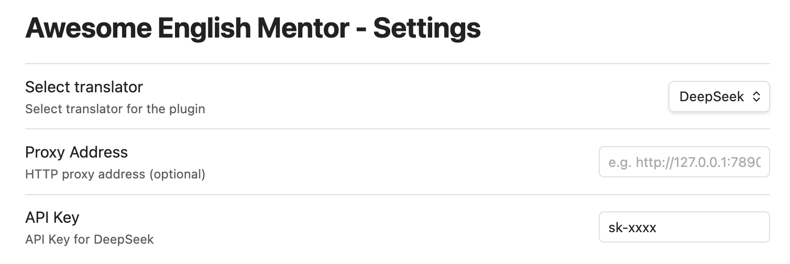

# Obsidian English Mentor Plugin

An [Obsidian](https://obsidian.md/) plugin that helps you improve your English writing by providing translation and refinement services using various AI models.

## Features
- **Text Translation**: Translate selected text to English
- [WIP] **Text Refinement**: Improve selected text to make it more native-like
- **Multiple AI Providers**: Supports multiple AI services including:
  - OpenAI
  - DeepSeek
  - Kimi
  - Coze
- **Proxy Support**: Configure HTTP proxy for API access
- **Keyboard Shortcuts**: Quick access with customizable hotkeys
  - `Cmd/Ctrl + U`: Translate selected text
  - `Cmd/Ctrl + Y`: Refine selected text

## Configuration


## Install

## Manual installation
1. Clone the repository:

2. At root folder, execute below commands:
```javascript
npm install

npm run build {your <vault>/.obsidian/plugins/ folder}
// e.g. npm run build "/Users/chenxi/Library/Mobile\\ Documents/iCloud~md~obsidian/Documents/my-vault/.obsidian/plugins/"
```


